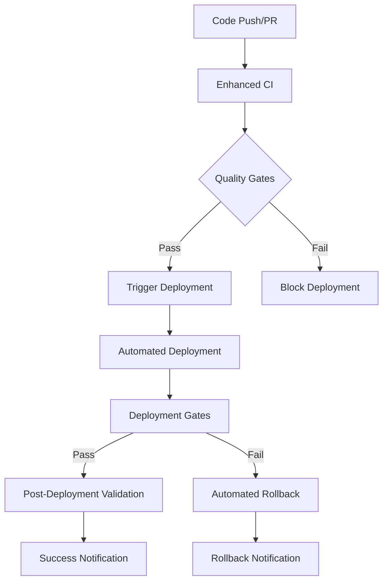

# CI/CD Pipeline Integration

This directory contains a comprehensive CI/CD pipeline integration for the Paperless Maverick application. The pipeline integrates all deployment automation scripts with automated testing, security scanning, and deployment gates with proper approval workflows.

## 📋 Overview

The CI/CD pipeline integration consists of several components:

1. **Enhanced CI Workflow** (`enhanced-ci.yml`) - Comprehensive continuous integration with quality gates
2. **Automated Deployment Pipeline** (`automated-deployment.yml`) - Full deployment automation with our scripts
3. **Deployment Gates** (`deployment-gates.yml`) - Security and performance validation gates
4. **CI/CD Configuration** (`config/ci-cd-config.yaml`) - Comprehensive pipeline configuration

## 🚀 Pipeline Architecture

### **Workflow Orchestration**



### **Pipeline Stages**

1. **Code Quality & Security** - ESLint, TypeScript, security scanning, secrets detection
2. **Comprehensive Testing** - Unit, integration, and performance tests
3. **Build & Container Security** - Docker builds with vulnerability scanning
4. **Deployment Gates** - Security and performance validation
5. **Automated Deployment** - Database, infrastructure, application, and monitoring deployment
6. **Post-Deployment Validation** - Health checks, smoke tests, and performance validation
7. **Automated Rollback** - Automatic rollback on validation failure

## 🔧 Enhanced CI Workflow (`enhanced-ci.yml`)

The enhanced CI workflow provides comprehensive continuous integration with quality gates and deployment triggers.

### Key Features

- **Multi-Stage Quality Checks** - Code quality, security, and testing validation
- **Deployment Readiness Gates** - Automated assessment of deployment readiness
- **Automatic Deployment Triggering** - Triggers deployment for main/develop branches
- **Comprehensive Reporting** - Detailed reports and GitHub step summaries

### Quality Gates

#### Code Quality & Security Gate
- **ESLint** - Code style and quality validation
- **TypeScript** - Type checking and compilation validation
- **Security Audit** - NPM audit and Snyk security scanning
- **Secrets Detection** - TruffleHog secrets scanning

#### Testing Gate
- **Unit Tests** - Comprehensive unit test execution
- **Integration Tests** - End-to-end integration testing
- **Performance Tests** - Performance benchmarking (non-blocking)

#### Build & Container Security Gate
- **Docker Builds** - Multi-platform container builds
- **Container Security** - Trivy vulnerability scanning
- **Image Publishing** - Secure image publishing to registry

### Usage Examples

```bash
# Automatic trigger on push to main/develop
git push origin main

# Manual workflow dispatch
gh workflow run enhanced-ci.yml

# Pull request validation
gh pr create --title "Feature" --body "Description"
```

## 🚀 Automated Deployment Pipeline (`automated-deployment.yml`)

The automated deployment pipeline integrates all our deployment automation scripts into a comprehensive workflow.

### Key Features

- **Environment-Specific Configuration** - Production, staging, and development configurations
- **Multiple Deployment Strategies** - Rolling, blue-green, and canary deployments
- **Manual Approval Gates** - Production deployment approval requirements
- **Comprehensive Integration** - Uses all our deployment automation scripts

### Deployment Flow

1. **Setup** - Determine environment and configuration
2. **Pre-deployment Validation** - Security scanning and configuration validation
3. **Manual Approval** - Production deployment approval (if required)
4. **Database Migration** - Automated database migration execution
5. **Infrastructure Deployment** - Kubernetes infrastructure deployment
6. **Application Deployment** - Application and worker deployment
7. **Monitoring Deployment** - Monitoring stack deployment
8. **Post-deployment Validation** - Comprehensive validation framework
9. **Automated Rollback** - Rollback on validation failure
10. **Notifications** - Slack and email notifications

### Usage Examples

```bash
# Automatic deployment on main branch push
git push origin main

# Manual deployment with custom parameters
gh workflow run automated-deployment.yml \
  -f environment=staging \
  -f deployment_strategy=blue-green \
  -f image_tag=v1.2.3

# Emergency deployment with force flag
gh workflow run automated-deployment.yml \
  -f environment=production \
  -f force_deployment=true
```

## 🚦 Deployment Gates (`deployment-gates.yml`)

The deployment gates workflow provides comprehensive security and performance validation before deployment.

### Key Features

- **Security Gate** - Multi-layered security validation
- **Performance Gate** - Load testing and performance validation
- **Environment-Specific Thresholds** - Different criteria per environment
- **Comprehensive Scoring** - Security and performance scoring systems

### Security Gate

#### Vulnerability Scanning
- **NPM Audit** - Dependency vulnerability scanning
- **Snyk Security** - Advanced security analysis
- **Container Scanning** - Trivy container vulnerability scanning
- **OWASP ZAP** - Dynamic application security testing

#### Security Scoring
- **Critical Vulnerabilities** - -20 points each
- **High Vulnerabilities** - -10 points each
- **Medium Vulnerabilities** - -2 points each
- **Base Score** - 100 points

#### Environment Thresholds
- **Production** - No critical, max 2 high vulnerabilities
- **Staging** - Max 1 critical, max 5 high vulnerabilities
- **Development** - Max 3 critical, max 10 high vulnerabilities

### Performance Gate

#### Load Testing
- **K6 Load Testing** - Automated performance testing
- **Response Time Validation** - P95 response time thresholds
- **Error Rate Validation** - Application error rate monitoring
- **Resource Utilization** - CPU and memory usage validation

#### Performance Scoring
- **Response Time** - Deductions for slow responses
- **Error Rate** - Deductions for high error rates
- **Base Score** - 100 points

#### Environment Thresholds
- **Production** - P95 < 2000ms, error rate < 1%
- **Staging** - P95 < 3000ms, error rate < 5%
- **Development** - P95 < 5000ms, error rate < 10%

## ⚙️ CI/CD Configuration (`config/ci-cd-config.yaml`)

Comprehensive configuration file defining pipeline behavior, quality gates, and deployment policies.

### Configuration Sections

#### Environment-Specific Settings
- **Deployment Policies** - Approval requirements, rollback settings
- **Quality Gates** - Security, performance, and code quality thresholds
- **Deployment Strategies** - Allowed deployment methods per environment

#### Pipeline Stages
- **Code Quality** - ESLint, TypeScript, security scanning
- **Testing** - Unit, integration, and performance testing
- **Build & Scan** - Container builds and security scanning
- **Deployment** - Database, infrastructure, application deployment

#### Security Scanning
- **NPM Audit** - Dependency vulnerability scanning
- **Snyk** - Advanced security analysis
- **Trivy** - Container vulnerability scanning
- **TruffleHog** - Secrets detection

## 🔗 Integration Points

### Deployment Automation Scripts

The CI/CD pipeline integrates with all our deployment automation scripts:

- **Master Deployment** - `infrastructure/production/scripts/master-deployment.sh`
- **Database Migration** - `infrastructure/production/scripts/migrate-database.sh`
- **Infrastructure Deployment** - `infrastructure/production/scripts/deploy-infrastructure.sh`
- **Application Deployment** - `infrastructure/production/scripts/deploy-application.sh`
- **Monitoring Deployment** - `infrastructure/production/scripts/deploy-monitoring.sh`
- **Rollback Automation** - `infrastructure/production/scripts/rollback-automation.sh`
- **Validation Framework** - `infrastructure/production/scripts/deployment-validation-framework.sh`

### External Integrations

#### GitHub
- **Branch Protection** - Required status checks and reviews
- **Deployment Environments** - Production approval environments
- **Security Scanning** - SARIF upload for security results

#### Container Registry
- **GHCR Integration** - GitHub Container Registry for image storage
- **Multi-platform Builds** - AMD64 and ARM64 support
- **Image Scanning** - Automated vulnerability scanning

#### Monitoring
- **Slack Notifications** - Deployment status notifications
- **GitHub Summaries** - Detailed step summaries and reports
- **Metrics Collection** - Pipeline and deployment metrics

## 📊 Quality Gates and Thresholds

### Production Environment
- **Security** - No critical vulnerabilities, max 2 high
- **Performance** - P95 < 2000ms, error rate < 1%
- **Code Quality** - 80% test coverage, ESLint/TypeScript passing
- **Approval** - Manual approval required

### Staging Environment
- **Security** - Max 1 critical, max 5 high vulnerabilities
- **Performance** - P95 < 3000ms, error rate < 5%
- **Code Quality** - 70% test coverage, ESLint/TypeScript passing
- **Approval** - Automatic deployment

### Development Environment
- **Security** - Max 3 critical, max 10 high vulnerabilities
- **Performance** - P95 < 5000ms, error rate < 10%
- **Code Quality** - 60% test coverage, ESLint/TypeScript passing
- **Approval** - Automatic deployment

## 🚨 Error Handling and Recovery

### Automated Rollback
- **Trigger Conditions** - Post-deployment validation failure
- **Rollback Strategy** - Full system rollback to previous version
- **Validation** - Health checks after rollback completion
- **Notifications** - Immediate alerts on rollback execution

### Retry Mechanisms
- **Failed Steps** - Automatic retry with exponential backoff
- **Timeout Handling** - Configurable timeouts per stage
- **Circuit Breaker** - Fail-fast on critical failures

### Monitoring and Alerting
- **Real-time Monitoring** - Pipeline execution monitoring
- **Failure Notifications** - Immediate alerts on failures
- **Metrics Collection** - Pipeline performance and success metrics

## 📈 Metrics and Reporting

### Pipeline Metrics
- **Deployment Frequency** - Number of deployments per time period
- **Success Rate** - Percentage of successful deployments
- **Lead Time** - Time from commit to production
- **Recovery Time** - Time to recover from failures

### Quality Metrics
- **Test Coverage** - Code coverage percentage
- **Security Score** - Vulnerability assessment score
- **Performance Score** - Performance validation score
- **Technical Debt** - Code quality and maintainability metrics

### Reporting
- **GitHub Step Summaries** - Detailed execution reports
- **Artifact Storage** - Test results, security reports, performance data
- **Dashboard Integration** - Grafana and monitoring dashboards

## 🔒 Security and Compliance

### Security Scanning
- **Multi-layer Scanning** - Code, dependencies, containers, runtime
- **Continuous Monitoring** - Ongoing security assessment
- **Vulnerability Management** - Automated vulnerability tracking
- **Compliance Reporting** - Security compliance documentation

### Access Control
- **RBAC** - Role-based access control for deployments
- **Approval Workflows** - Manual approval for production deployments
- **Audit Logging** - Comprehensive audit trails
- **Secrets Management** - Secure handling of sensitive data

## 🛠️ Troubleshooting

### Common Issues
- **Quality Gate Failures** - Check security scans and test results
- **Deployment Failures** - Review deployment logs and validation results
- **Performance Issues** - Analyze performance test results and metrics
- **Rollback Issues** - Verify rollback automation and health checks

### Debug Commands
```bash
# Check workflow status
gh run list --workflow=enhanced-ci.yml

# View workflow logs
gh run view <run-id> --log

# Re-run failed workflow
gh run rerun <run-id>

# Check deployment status
kubectl get deployments -n paperless-maverick
```

## 📚 Additional Resources

- [GitHub Actions Documentation](https://docs.github.com/en/actions)
- [Kubernetes Deployment Strategies](https://kubernetes.io/docs/concepts/workloads/controllers/deployment/)
- [Container Security Best Practices](https://kubernetes.io/docs/concepts/security/)
- [CI/CD Pipeline Best Practices](https://docs.github.com/en/actions/deployment/about-deployments-and-environments)
