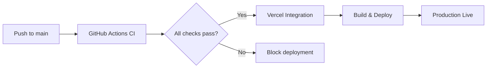
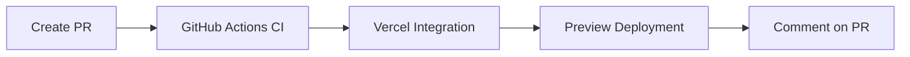

# Deployment Strategy

## Overview

Mataresit uses **Vercel GitHub Integration** for automatic deployments, providing a streamlined and efficient deployment process without consuming GitHub Actions minutes.

## Current Setup

### ✅ Vercel GitHub Integration (Active)

**Connected Repository**: `noa10/mataresit`  
**Integration Status**: Active since June 14, 2024

**Automatic Deployments**:
- 🚀 **Production**: Automatic deployment on pushes to `main` branch
- 🔍 **Preview**: Automatic preview deployments for all pull requests
- 💬 **PR Comments**: Automatic deployment status comments on pull requests
- 🔄 **Rollback**: Built-in rollback capability through Vercel dashboard

**Benefits**:
- Zero GitHub Actions minutes consumed for deployments
- Native Vercel optimizations and CDN integration
- Automatic preview URLs for testing
- Built-in deployment monitoring and analytics
- Seamless integration with Vercel dashboard

### 🔧 GitHub Actions CI (Testing & Validation Only)

**Workflow**: `.github/workflows/ci.yml`

**Responsibilities**:
- ✅ Code quality checks (ESLint, TypeScript)
- ✅ Security auditing and secret scanning
- ✅ Unit and integration testing
- ✅ Build validation and artifact creation
- ✅ Deployment readiness gate

**Does NOT handle**:
- ❌ Vercel deployments (handled by Vercel integration)
- ❌ Production releases (handled by Vercel integration)

## Deployment Flow

### Production Deployment (main branch)

1. **Developer pushes to `main`**
2. **GitHub Actions runs CI checks** (quality, tests, build)
3. **If CI passes**: Vercel integration automatically deploys
4. **If CI fails**: Deployment is blocked (Vercel won't deploy broken code)

### Preview Deployment (pull requests)

1. **Developer creates pull request**
2. **GitHub Actions runs CI checks**
3. **Vercel integration creates preview deployment**
4. **Preview URL posted as PR comment**

## Configuration

### Vercel Integration Settings

**Location**: Vercel Dashboard → Project Settings → Git

**Current Configuration**:
- ✅ Pull Request Comments: Enabled
- ✅ Commit Comments: Disabled (to reduce noise)
- ✅ Deployment Status Events: Enabled
- ✅ Repository Dispatch Events: Enabled

### GitHub Secrets (For CI Only)

**Required for CI workflow**:
- `TEST_SUPABASE_URL` - Test database URL
- `TEST_SUPABASE_ANON_KEY` - Test database anonymous key
- `TEST_SUPABASE_SERVICE_ROLE_KEY` - Test database service role key
- `TEST_GEMINI_API_KEY` - Test AI API key

**Vercel secrets** (VERCEL_TOKEN, VERCEL_ORG_ID, VERCEL_PROJECT_ID) are **no longer used** since we rely on Vercel GitHub integration.

## Monitoring & Troubleshooting

### Deployment Status

**Check deployment status**:
1. **Vercel Dashboard**: https://vercel.com/noa10s-projects/mataresit
2. **GitHub Actions**: Repository → Actions tab
3. **PR Comments**: Automatic status updates on pull requests

### Common Issues

**Deployment not triggered**:
- Check if CI checks are passing
- Verify Vercel integration is connected
- Check Vercel dashboard for build logs

**Preview deployment missing**:
- Ensure PR is from a branch (not fork)
- Check Vercel integration settings
- Verify repository permissions

**Build failures**:
- Check Vercel build logs in dashboard
- Verify environment variables are set
- Check for dependency issues

### Rollback Process

**Via Vercel Dashboard**:
1. Go to Vercel project dashboard
2. Navigate to "Deployments" tab
3. Find previous successful deployment
4. Click "Promote to Production"

**Via Git**:
1. Revert problematic commit
2. Push to main branch
3. Vercel will automatically deploy the reverted version

## Migration Notes

**Previous Setup** (Removed):
- ❌ `.github/workflows/vercel-deploy.yml` - Redundant deployment workflow
- ❌ `.github/workflows/vercel-rollback.yml` - Redundant rollback workflow
- ❌ Vercel deployment steps in CI workflow

**Why Changed**:
- Eliminated deployment conflicts between GitHub Actions and Vercel integration
- Reduced GitHub Actions minute consumption
- Simplified deployment process
- Improved reliability with native Vercel integration

## Best Practices

### For Developers

1. **Always create PRs** for code changes to get preview deployments
2. **Check CI status** before merging to main
3. **Test preview deployments** before merging
4. **Monitor deployment status** in Vercel dashboard

### For Maintainers

1. **Keep Vercel integration connected** and up-to-date
2. **Monitor deployment analytics** in Vercel dashboard
3. **Review failed deployments** promptly
4. **Update environment variables** in Vercel dashboard when needed

## Support

**For deployment issues**:
1. Check Vercel dashboard build logs
2. Review GitHub Actions CI results
3. Verify environment variables and secrets
4. Contact team lead if issues persist

**Documentation**:
- [Vercel Git Integration Docs](https://vercel.com/docs/deployments/git)
- [GitHub Actions Documentation](https://docs.github.com/en/actions)
