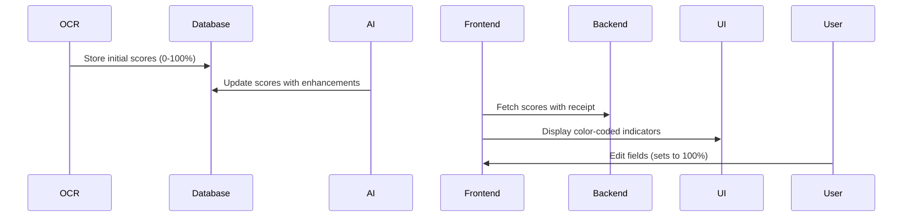

# Confidence Score Implementation Guide

## Overview
The confidence score system evaluates the accuracy of extracted receipt data through:
1. OCR processing (initial scores)
2. AI enhancement (refined scores)
3. User verification (final scores)

## Data Flow


## Key Components

### 1. Backend (receiptService.ts)
```typescript
// Fetching scores with receipt data
const fetchReceiptById = async (id: string) => {
  const { data: confidence } = await supabase
    .from("confidence_scores")
    .select("*")
    .eq("receipt_id", id)
    .single();
  
  return {
    ...receipt,
    confidence: confidence || { merchant: 0, date: 0, total: 0 }
  };
};
```

### 2. Frontend Display (ReceiptViewer.tsx)
```tsx
// Confidence indicator component
function ConfidenceIndicator({ score }: { score?: number }) {
  const color = score >= 80 ? 'bg-green-500' : 
               score >= 60 ? 'bg-yellow-500' : 'bg-red-500';
  
  return (
    <div className="flex items-center gap-1">
      <span className={`inline-block w-4 h-1 rounded ${color}`}></span>
      <span className="text-xs">{score || 0}%</span>
    </div>
  );
}

// Field implementation example
<Label htmlFor="merchant">Merchant</Label>
<ConfidenceIndicator score={receipt.confidence?.merchant} />
```

## Troubleshooting

### Common Issues
1. **Scores not displaying**:
   - Verify `fetchReceiptById` returns confidence data
   - Check browser console for errors
   - Confirm confidence_scores table has records

2. **Incorrect scores**:
   - Review OCR processing logs
   - Check AI enhancement results
   - Validate score calculation logic

## Best Practices
1. Always display scores for key fields (merchant, date, total)
2. Update scores immediately after user edits
3. Log score changes for auditing