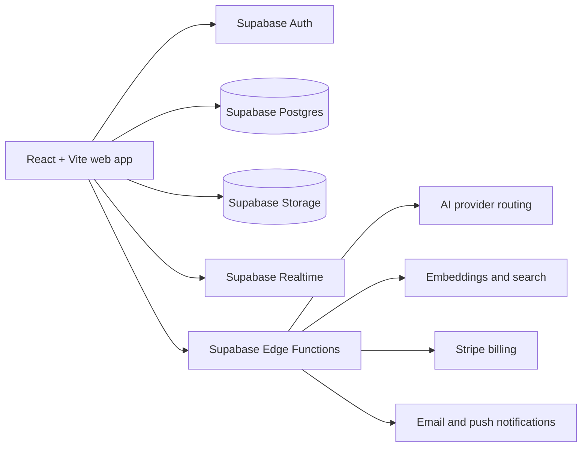

<div align="center">
  
  <h1>Mataresit</h1>
  <p><strong>AI-assisted receipt processing and expense management</strong></p>
  <p>Turn receipt images into structured, searchable expense records.</p>
</div>

---

Mataresit is a web-based receipt and expense workspace for individuals, small businesses, and teams. Upload a receipt, let AI vision extract structured fields, review confidence-scored results, and then search, analyze, export, or submit expenses through one system.

The application includes English and Bahasa Malaysia localization, Malaysian currency and business metadata, team workflows, and integrations for receipt management. It is built as a React/Vite frontend on top of Supabase.

> **Project status:** active development. This repository contains both the user-facing application and the backend infrastructure used to operate it. Some advanced features are plan-dependent or still being stabilized.
>
> **Temporary production URL:** [https://mataresit.vercel.app](https://mataresit.vercel.app). Replace this with the final canonical domain when it is ready.

[Capabilities](#capabilities) · [Architecture](#architecture) · [Getting started](#getting-started) · [Deployment](#deployment-model) · [Contributing](#contributing)

## What problem does Mataresit solve?

Receipts are often photographed, stored in chat threads, or entered manually into spreadsheets. Mataresit turns that paper trail into organized data:

```text
Receipt image
    ↓
AI vision extraction
    ↓
Review and correct confidence-scored fields
    ↓
Search, categorize, analyze, and export
    ↓
Create claims or collaborate with a team
```

The goal is not to remove human review. It is to make the review faster by bringing the receipt image, extracted data, and follow-up workflows together.

## Product preview


*Illustrative receipt capture preview. The application supports multiple currencies and Malaysian-aware formatting.*

## Capabilities

### Receipt capture and AI

- Upload receipt images from the dashboard.
- Process the primary path with configurable AI vision providers.
- Extract merchant, date, totals, tax, payment method, line items, and other structured fields.
- Receive confidence indicators for fields that may need attention.
- Review, edit, categorize, and save extracted data.
- Generate thumbnails for faster receipt browsing.
- Batch-upload supported by the client and backend upload workflow.

The upload interface accepts JPEG, PNG, and PDF files, while the primary processing path is optimized for images. Validate PDF processing in the target environment before relying on it.

### Search and organization

- Natural-language and hybrid search across receipt data.
- Search by merchant, category, date, amount, and receipt content.
- Automatic and manual categorization.
- Dashboard statistics and spending analysis.
- Receipt and report export workflows.

### Team workflows

- Team and workspace management.
- Member invitations and role-based access.
- Receipt sharing and team visibility.
- Expense claims with submission and approval states.
- Notifications for processing, team, and claim activity.

The current team roles include `owner`, `admin`, `member`, and `viewer`.

### Platform features

- English and Bahasa Malaysia (`en` and `ms`) localization.
- Malaysian currency formatting and business/tax metadata.
- Responsive web interface with light and dark themes.
- Subscription tiers backed by Stripe.
- External API surface for approved integrations, subject to authentication, scopes, quotas, and plan availability.

Features such as the external API, gamification, PWA/offline behavior, and some advanced integrations should be treated as advanced or experimental until their deployment status is confirmed.

## Architecture

Mataresit uses a serverless frontend/backend split:



### Main responsibilities

- **Frontend:** React routes, receipt dashboard, review editor, search, analytics, teams, claims, settings, and billing UI.
- **Database:** profiles, receipts, line items, categories, teams, claims, subscriptions, notifications, API keys, and supporting audit data.
- **Storage:** original receipt files, avatars, and generated thumbnails.
- **Realtime:** processing status and notification updates.
- **Edge Functions:** receipt processing, AI enhancement, embeddings, search, reports, notifications, billing, and the external API.
- **AI providers:** Gemini is the primary configured path; Groq and OpenRouter paths exist in the provider-routing layer. Model availability and selection can change.

> **Data handling:** Receipt images and extracted data are sent to the configured AI provider for processing. Review the provider's terms and your own data-handling requirements before processing sensitive or production receipts.

## Technology

| Area | Technology |
| --- | --- |
| Frontend | React 18, TypeScript, Vite 8 |
| UI | Tailwind CSS 4, Radix UI, Framer Motion |
| Routing | React Router 7 |
| Server state | TanStack Query 5 |
| Backend | Supabase Postgres, Auth, Storage, Realtime |
| Server runtime | Deno Supabase Edge Functions |
| AI | Gemini-first provider routing with optional Groq/OpenRouter paths |
| Billing | Stripe subscriptions and checkout |
| Internationalization | i18next with English and Bahasa Malaysia resources |
| Testing | Vitest 4, Playwright, MSW |
| Frontend hosting | Vercel |
| CI/security | GitHub Actions, CodeQL, npm audit, TruffleHog, and GitLeaks |

## Getting started

### Prerequisites

- Node.js 20 (see [`.nvmrc`](./.nvmrc))
- npm
- A Supabase project for a hosted development environment, or the Supabase CLI for local development
- A Gemini API key for AI receipt processing
- Stripe test credentials only if you are working on billing

The repository does not require Docker or Kubernetes for its Vercel deployment. A local Supabase stack normally uses Docker through the Supabase CLI.

### Clone and install

```bash
git clone https://github.com/noa10/mataresit.git
cd mataresit

nvm use
npm ci
cp .env.example .env.local
```

Edit your local `.env.local` file using [`.env.example`](./.env.example) with the public URL and anonymous key for a development Supabase project. Do not put service-role keys or other server secrets in a `VITE_` variable.

> **Environment safety:** Do not start the app with unresolved Supabase variables. Some legacy integration paths contain deployment-specific fallbacks, so always select an explicit local or development project before running the frontend.

### Run the frontend

```bash
npm run dev
```

The Vite development server is available at the URL printed by the command, normally `http://localhost:5173`.

### Use a local Supabase stack

For an isolated local backend:

```bash
supabase start
supabase status
supabase db reset
```

Copy the local URL and anonymous key printed by `supabase status` into `.env.local`, then start the frontend:

```bash
npm run dev
```

`supabase db reset` affects the local database only. Do not use `supabase db push` against a shared or production project as part of normal local setup.

AI processing also requires the relevant Edge Functions and server-side provider secrets. Keep those secrets in the local Supabase environment or the appropriate Supabase project settings; never commit them to `.env.local` or the repository.

## Configuration

The configuration is split between Vite variables and server-side Edge Function secrets.

### Frontend variables

| Variable | Purpose |
| --- | --- |
| `VITE_SITE_URL` | Public application URL used for production links; leave unset locally |
| `VITE_SUPABASE_URL` | Supabase project URL |
| `VITE_SUPABASE_ANON_KEY` | Browser-safe Supabase anonymous/publishable key |
| `VITE_STRIPE_PUBLIC_KEY` | Stripe publishable key |
| `VITE_STRIPE_*_PRICE_ID` | Stripe Price IDs used by checkout |
| `VITE_ENABLE_REALTIME` | Optional realtime feature flag |
| `VITE_REALTIME_HEARTBEAT_INTERVAL` | Optional realtime heartbeat setting |

### Server-side secrets

The following values are used by Edge Functions or server integrations and must not be exposed to the browser:

- `GEMINI_API_KEY`
- `GROQ_API_KEY` or `OPENROUTER_API_KEY` when those providers are enabled
- `STRIPE_SECRET_KEY`
- `STRIPE_WEBHOOK_SECRET`
- `SITE_URL` and `FRONTEND_URL` for links generated by Edge Functions
- `FROM_EMAIL` for Resend sending

The exact list and examples are maintained in [`.env.example`](./.env.example).

## Common commands

| Command | Description |
| --- | --- |
| `npm run dev` | Start the Vite development server |
| `npm run build` | Create a production build |
| `npm run preview` | Preview the production build locally |
| `npm run lint` | Run ESLint |
| `npm run test` | Run the Vitest suite |
| `npm run test:unit` | Run the unit-focused Vitest configuration |
| `npm run test:integration` | Run integration tests; external test services may be required |
| `npm run test:alerting:unit` | Run alerting unit tests |
| `npm run test:queue:unit` | Run queue unit tests |

## Repository layout

```text
mataresit/
├── src/
│   ├── components/       # UI, feature, and shared components
│   ├── contexts/         # Auth, team, theme, language, billing, and app state
│   ├── hooks/            # Data-fetching and interaction hooks
│   ├── lib/              # Shared utilities, i18n, search, export, and configuration
│   ├── pages/            # Public, authenticated, team, and admin routes
│   ├── services/         # Business logic and Supabase-facing services
│   └── locales/          # English and Bahasa Malaysia translations
├── supabase/
│   ├── functions/        # Deno Edge Functions
│   ├── migrations/       # Database migration history
│   └── config.toml       # Supabase configuration
├── docs/                 # User and technical documentation
├── scripts/              # Maintenance, monitoring, and deployment utilities
├── tests/                # Unit, integration, E2E, alerting, and queue tests
├── public/               # Static assets and generated documentation assets
└── .github/              # Workflows, security configuration, and maintainer notes
```

## External API

The repository includes a versioned `external-api` Supabase Edge Function and a draft [OpenAPI specification](./docs/api/openapi.yaml). The API surface is designed for receipt, claim, search, analytics, category, team, and profile operations.

API requests are authenticated and scoped, and access is subject to subscription limits and quotas. Treat the API as an advanced integration surface rather than a stable SDK until the deployment URL, versioning policy, and production availability are confirmed.

## Deployment model

### Frontend

The frontend is configured for Vercel:

- Build command: `npm run build`
- Output directory: `dist`
- SPA rewrites are defined in [`vercel.json`](./vercel.json)
- Vercel's Git integration is responsible for frontend deployments

### Backend

Supabase provides the managed PostgreSQL database, Auth, Storage, Realtime, and Edge Functions. For the current temporary Vercel host, set the Vercel Production environment variable `VITE_SITE_URL=https://mataresit.vercel.app`, configure the hosted Supabase Auth **Site URL** as `https://mataresit.vercel.app`, and allow `https://mataresit.vercel.app/**` for redirects. Set the Supabase Edge Function secrets `SITE_URL` and `FRONTEND_URL` to the same origin, and configure a verified `FROM_EMAIL` for Resend.

When the final domain is selected, update the Vercel `VITE_SITE_URL`, hosted Supabase Auth Site URL/redirect allow-list, `SITE_URL`/`FRONTEND_URL` Edge Function secrets, GitHub `APP_DOMAIN`, and the canonical/sitemap references together.

A production deployment must also configure:

- Supabase Auth redirect URLs and providers
- Supabase Edge Function secrets: `SITE_URL`, `FRONTEND_URL`, and a verified `FROM_EMAIL`
- Storage buckets and access policies
- Database migrations
- Edge Function secrets
- Stripe products, webhook signing secrets, and webhook delivery
- AI provider credentials

### Continuous integration

The current GitHub workflows perform code quality checks, tests, builds, Supabase validation, security scanning, and scheduled monitoring. The Supabase validation workflow is validation-oriented; it does not replace the required production deployment steps.

See [`.github/README.md`](./.github/README.md) for the current automation overview.

## Documentation

- [Documentation index](./docs/README.md)
- [Local development guide](./docs/development/LOCAL_DEVELOPMENT_GUIDE.md)
- [Edge Function processing notes](./supabase/functions/process-receipt/README.md)

Some documents under `docs/` predate the current Vercel + Supabase workflow and should be reviewed before use. The root README and the source code should be treated as the current source of truth when documentation conflicts.

## Contributing

Contributions are welcome. Please read [CONTRIBUTING.md](./CONTRIBUTING.md) before opening a pull request.

At a minimum:

1. Create a focused branch.
2. Do not commit credentials, production data, or real receipt images.
3. Run `npm run lint`, the relevant tests, and `npm run build`.
4. Call out any required migrations, Edge Function changes, or environment variables.
5. Keep user-facing documentation and translations in sync with behavior changes.

## Security

Do not open a public issue for a suspected vulnerability or expose production credentials. Do not include real receipts, access tokens, service-role keys, API keys, or private infrastructure details in issues, pull requests, screenshots, or test fixtures.

Because a private security contact has not yet been published in this repository, confirm a private reporting channel with the maintainer before disclosing a vulnerability.

## Support and feedback

- [Open an issue](https://github.com/noa10/mataresit/issues) for reproducible bugs and feature requests.
- Use pull requests for proposed code or documentation changes.
- Do not use public issues for security reports or sensitive receipt data.

## License status

This repository does not currently include a `LICENSE` file. Until the project owner adds one, do not assume that the code is released under MIT or another open-source license. Confirm reuse and redistribution terms with the maintainers.

## Acknowledgements

Mataresit builds on the work of the open-source communities behind:

- [Supabase](https://supabase.com/)
- [Vercel](https://vercel.com/)
- [Stripe](https://stripe.com/)
- [Google Gemini](https://ai.google.dev/)
- [Radix UI](https://www.radix-ui.com/)
- [Tailwind CSS](https://tailwindcss.com/)
- [Vitest](https://vitest.dev/)
- [Playwright](https://playwright.dev/)

---

<div align="center">
  <strong>More business, less paperwork.</strong>
</div>
