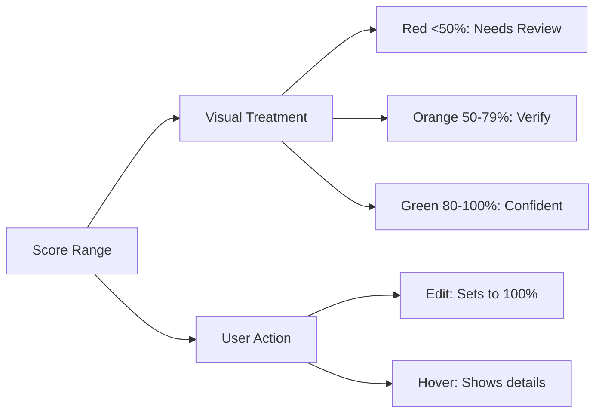

# Confidence Score UI Implementation

## 1. Visual Design System


## 2. Component Specifications

### ConfidenceIndicator Component
```tsx
interface ConfidenceIndicatorProps {
  score: number; 
  loading?: boolean;
  fieldType?: string;
}

export function ConfidenceIndicator({
  score = 50, // Default to medium confidence
  loading = false,
  fieldType
}: ConfidenceIndicatorProps) {
  // Color mapping
  const color = score >= 80 ? 'bg-green-500' :
               score >= 50 ? 'bg-yellow-500' : 'bg-red-500';
  
  // Tooltip content
  const tooltipText = score === 100 
    ? 'Verified by user'
    : `AI-detected with ${score}% confidence`;

  return (
    <div className="flex items-center gap-1 group">
      {/* Visual indicator */}
      <span className={`inline-block w-3 h-3 rounded-full ${color}`} />
      
      {/* Percentage */}
      <span className="text-xs">{score}%</span>
      
      {/* Tooltip */}
      <div className="tooltip">
        <p>{tooltipText}</p>
        {score < 100 && fieldType && (
          <p>Edit to verify this {fieldType}</p>
        )}
      </div>
    </div>
  );
}
```

## 3. Key Improvements

1. **Visual Hierarchy**:
   - Color-coded indicators (red/orange/green)
   - Percentage display with tooltip explanation
   - Loading states during processing

2. **User Interaction**:
   - Fields turn green when edited (100% confidence)
   - Hover tooltips explain confidence levels
   - Toast notifications on verification

3. **Implementation**:
```tsx
<ReceiptField
  label="Total Amount"
  value={receipt.total}
  confidence={receipt.confidence?.total || 50} // Default 50%
  fieldType="total"
/>
```

## 4. Integration Points

1. **ReceiptCard**:
   - Compact confidence indicators
   - Highlight low-confidence fields

2. **ReceiptViewer**:
   - Detailed confidence displays
   - Field-specific guidance
   - Verification controls