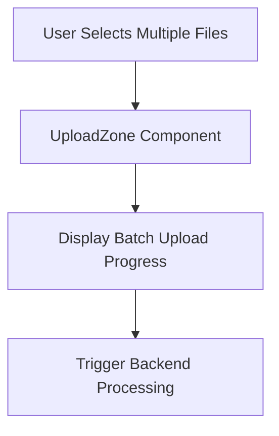
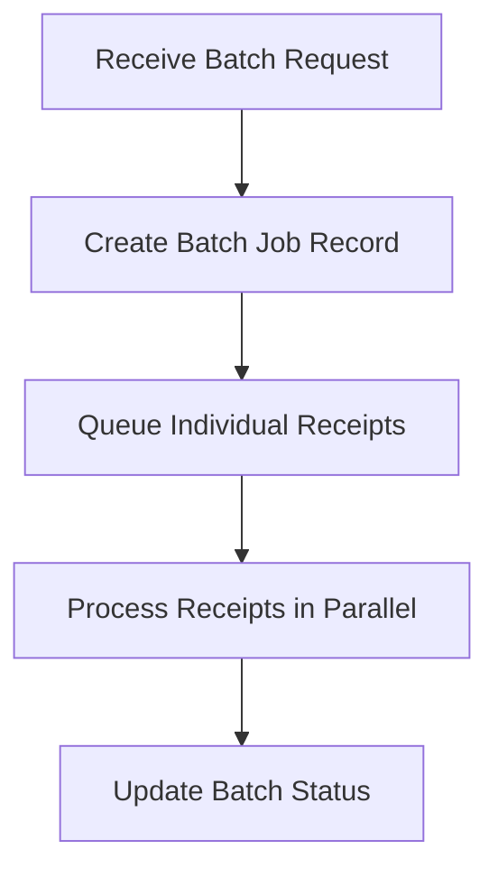

# Batch Processing Feature Plan

## Objective
Implement batch processing of multiple receipts to enhance user efficiency and system scalability.

## Scope
- **Frontend**: Modify UploadZone to accept multiple files
- **Backend**: Process receipts in parallel using a queue system
- **Database**: Track batch jobs and individual receipt statuses
- **Error Handling**: Graceful failure recovery for individual receipts

## Implementation Steps

### 1. Frontend Enhancements


- **UploadZone Updates**:
  - Add multi-file selection interface
  - Track individual file upload progress
  - Display batch-level status (e.g., "3/5 processed")

### 2. Backend Processing


- **New API Endpoint**:
  ```http
  POST /api/batches
  Content-Type: multipart/form-data

  @receipt1.jpg
  @receipt2.pdf
  ...
  ```
- **Processing Queue**:
  - Use Supabase Edge Functions with Redis for queue management
  - Implement rate limiting to prevent overload

### 3. Database Schema Changes
```sql
CREATE TABLE batches (
    id UUID PRIMARY KEY,
    user_id UUID REFERENCES auth.users,
    status TEXT DEFAULT 'processing',
    created_at TIMESTAMPTZ DEFAULT NOW()
);

ALTER TABLE receipts ADD COLUMN batch_id UUID REFERENCES batches(id);
```

### 4. Error Handling Strategy
- **Individual Receipt Failures**:
  - Log errors in `processing_logs`
  - Allow partial batch completion
- **Retry Mechanism**:
  - Automatic retry for transient errors (e.g., network issues)
  - Manual retry option in UI for persistent failures

### 5. Performance Optimization
- **Parallel Processing**:
  - Use worker threads for OCR/AI tasks
  - Configurable concurrency limits
- **Caching**:
  - Cache common AI enhancement results
  - Pre-warm cache with historical data

## Testing Plan
1. **Unit Tests**:
   - Test batch creation endpoint
   - Verify parallel processing logic
2. **Integration Tests**:
   - Upload 10 receipts in batch
   - Validate all reach 'completed' status
3. **Load Testing**:
   - Simulate 100 concurrent batches
   - Monitor system resource usage

## Documentation Updates
- Update README.md with batch processing instructions
- Add API documentation for new endpoints
- Include troubleshooting guide for batch failures

## Rollout Strategy
1. **Staging Deployment**:
   - Test with sample batches
   - Validate error handling
2. **User Acceptance Testing (UAT)**:
   - Invite power users to test
   - Gather feedback
3. **Production Deployment**:
   - Gradual rollout (5% → 100%)
   - Monitor performance metrics