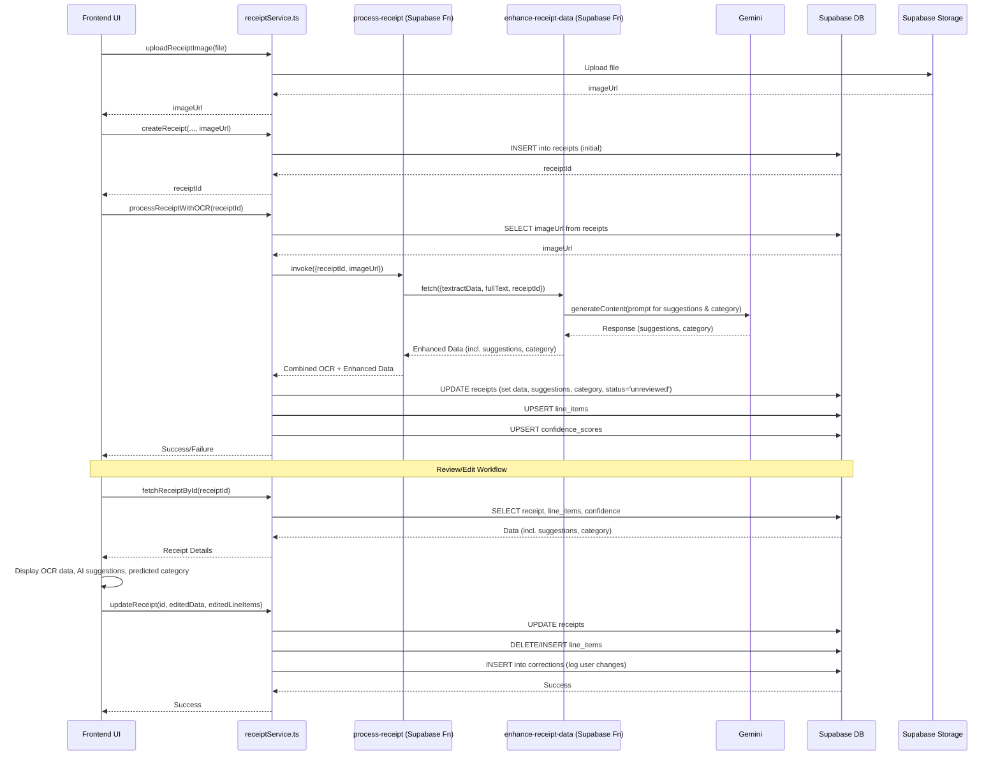

# Plan: AI Capability Integration (Gemini + Supabase)

This plan outlines the steps to integrate AI suggestions, categorization, and a feedback loop into the existing receipt processing workflow.

**Goals:**

1.  **AI Suggestions:** Generate field-level correction suggestions using Gemini.
2.  **AI Categorization:** Predict a category (e.g., Groceries, Dining) using Gemini.
3.  **UI Integration:** Display suggestions and the predicted category in the review UI.
4.  **Feedback Loop:** Log user corrections to enable future improvements.
5.  **Database Updates:** Add necessary columns and tables.

**Workflow Diagram:**



**Implementation Steps:**

**Phase 1: Backend - Enhance AI Processing**

1.  **Modify `enhance-receipt-data` Function (`supabase/functions/enhance-receipt-data/index.ts`):**
    *   Update the prompt sent to Gemini to explicitly ask for:
        *   Field-level suggestions for potential OCR errors (e.g., merchant name, date format, total mismatches). Return these as a JSON object (`suggestions`).
        *   A predicted category from a predefined list (e.g., "Groceries", "Dining", "Travel", "Utilities", "Other"). Return this as a string (`predicted_category`).
    *   Adjust the expected JSON response format in the prompt and the parsing logic to handle the new `suggestions` object and `predicted_category` string.
    *   Ensure the function returns these new fields along with the existing ones (currency, payment_method).

**Phase 2: Database Schema**

2.  **Create Migration File (`supabase/migrations/YYYYMMDDHHMMSS_add_ai_features.sql`):**
    *   Add SQL to `ALTER TABLE receipts` to add the new columns:
        *   `ai_suggestions JSONB NULL`
        *   `predicted_category TEXT NULL`
    *   Add SQL to `CREATE TABLE corrections` as defined previously:
        ```sql
        CREATE TABLE corrections (
          id SERIAL PRIMARY KEY,
          receipt_id INTEGER REFERENCES receipts(id) ON DELETE CASCADE,
          field_name TEXT NOT NULL,
          original_value TEXT,
          ai_suggestion TEXT,
          corrected_value TEXT NOT NULL,
          created_at TIMESTAMP WITH TIME ZONE DEFAULT NOW()
        );
        CREATE INDEX idx_corrections_receipt_id ON corrections(receipt_id);
        ```

**Phase 3: Frontend - Integration & Feedback**

3.  **Update Frontend Service (`src/services/receiptService.ts`):**
    *   Modify the `processReceiptWithOCR` function:
        *   Extract `ai_suggestions` and `predicted_category` from the result.
        *   Add these fields to the `updateData` object passed to `updateReceipt`.
    *   Modify the `updateReceipt` function (or create `logCorrection`):
        *   Implement logic to log changes to the `corrections` table before updating `receipts`. Consider fetching the current receipt state just before update to accurately log differences.
    *   Modify `fetchReceiptById` to select and return `ai_suggestions` and `predicted_category`. Update the `ReceiptWithDetails` type.

4.  **Update Review/Edit UI Component (`src/components/ReceiptViewer.tsx`):**
    *   Fetch data using the updated `fetchReceiptById`.
    *   Display `predicted_category` (e.g., in a pre-filled dropdown).
    *   Display `ai_suggestions` alongside OCR fields with "Accept" buttons. Handle cases where suggestions might be missing for some fields.
    *   Implement "Accept" button logic to update the form's state.
    *   On save:
        *   Identify fields changed by the user (comparing initial state fetched vs. current form state).
        *   Call `logCorrection` (if implemented separately) or include logic within the save handler to log these changes to the `corrections` table.
        *   Call `updateReceipt` with final user-confirmed data.

**Phase 4: Deployment & Testing**

5.  **Deploy Database Migrations:**
    *   Ensure the Supabase CLI is configured for the target environment (local/staging/production).
    *   Run the migration using the Supabase CLI: `supabase migration up`.
    *   Verify the migration status in the Supabase dashboard or using `supabase migration list`.
    *   Have a plan for rollback if needed (though unlikely for additive changes), potentially using `supabase migration down` (use with caution).

6.  **Deploy Supabase Functions:**
    *   Ensure necessary environment variables (e.g., `GEMINI_API_KEY`, `AWS_ACCESS_KEY_ID`, etc.) are set in the Supabase project dashboard secrets for the target environment.
    *   Deploy the updated functions using the Supabase CLI:
        *   `supabase functions deploy process-receipt`
        *   `supabase functions deploy enhance-receipt-data`
    *   Check the deployment status and logs in the Supabase dashboard.

7.  **Build & Deploy Frontend:**
    *   Run the build command for the frontend application (e.g., `npm run build` or `bun run build`).
    *   Deploy the built static assets or application bundle to your hosting provider (e.g., Vercel, Netlify, AWS S3/CloudFront, etc.) according to their specific deployment procedures.

8.  **Testing:**
    *   **Component Tests:** Test the `ReceiptViewer.tsx` component in isolation to verify UI rendering with/without suggestions/category, state updates on interaction ("Accept" button), and form submission logic.
    *   **Integration Tests:**
        *   Test `receiptService.ts` functions (`processReceiptWithOCR`, `updateReceipt`, `fetchReceiptById`) to ensure they correctly interact with the deployed Supabase functions and database schema. Mock Supabase client calls if necessary.
        *   Test the interaction between `process-receipt` and `enhance-receipt-data` functions, potentially using mock data or local Supabase environment.
    *   **End-to-End (E2E) Tests:** (Manual or Automated)
        *   **Happy Path:** Upload -> Process -> View -> Verify AI data displayed -> Edit/Accept -> Save -> Verify DB update (`receipts` & `corrections`).
        *   **Error Handling:** Test scenarios where Gemini API fails or returns unexpected data. Does the UI handle it gracefully? Is processing still completed with OCR data?
        *   **Edge Cases:** Test with different receipt types, currencies, image qualities. Test without AI suggestions generated.
    *   **Regression Testing:** Verify existing core functionalities (upload, basic view, manual edit without AI) remain unaffected.
