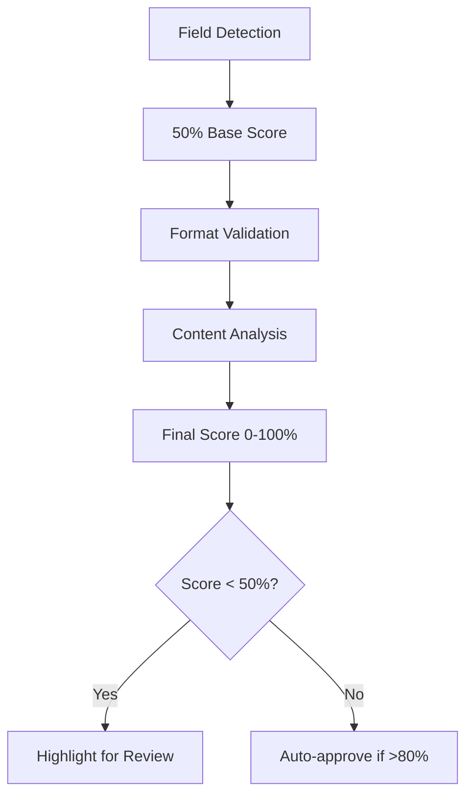

# Enhanced Confidence Scoring System

## 1. Scoring Framework


## 2. Improved Scoring Logic

### Core Principles:
- **Default 50% base score** for detected fields
- **Bonus points** for:
  - Valid formats (+20-30%)
  - Known patterns (+10-20%)
  - Contextual matches (+10-15%)
- **Penalties** for:
  - Unrecognized patterns (-10-15%)
  - Format violations (-20-30%)

### Field-Specific Examples:
```typescript
// Merchant scoring
function scoreMerchant(value: string): number {
  let score = 50; // Base score
  
  // Format validation
  if (value.length >= 3) score += 20;
  
  // Known merchant check
  if (knownMerchants.includes(value)) score += 30;
  
  return Math.min(score, 100);
}

// Date scoring
function scoreDate(value: string): number {
  let score = 50;
  
  // Valid date check
  if (isValidDate(value)) score += 30;
  
  // Recent date bonus
  if (isRecentDate(value)) score += 20;
  
  return score;
}
```

## 3. Implementation Changes

1. **Backend Updates**:
```typescript
// Updated processReceiptWithAI
const processReceiptWithAI = async (imageData) => {
  // Initialize with 50% scores
  const initialScores = {
    merchant: 50,
    date: 50,
    total: 50,
    paymentMethod: 50
  };
  
  // Process and update scores
  const aiData = await performAIProcessing(imageData);
  const finalScores = calculateFinalScores(aiData);

  return { ...aiData, confidence: finalScores };
};
```

2. **Score Calculation**:
```typescript
function calculateFinalScores(data) {
  return {
    merchant: scoreMerchant(data.merchant),
    date: scoreDate(data.date),
    total: scoreTotal(data.total),
    paymentMethod: scorePaymentMethod(data.paymentMethod)
  };
}